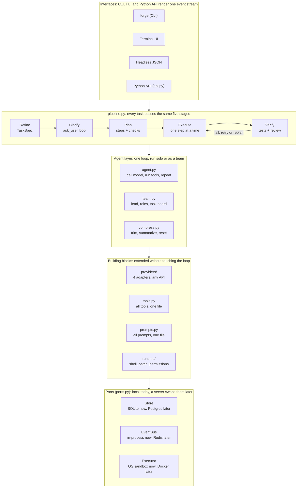

# Forge — Multi-Provider Code Agent Framework: Build Plan

2026-10-04 · @Maximilian Dum

## Vision and goals

Forge is an open, provider-agnostic coding agent in the class of Codex CLI and Claude Code: one program that runs as a terminal app or a headless CLI, talks to any LLM API, and is built so a server mode can be added later without a rewrite. Every task follows the same disciplined pipeline: refine the prompt, ask clarifying questions, write a plan, execute it step by step, verify.

Hard requirements, taken from the brief:

- **Any provider.** Works with dozens of API vendors (OpenAI, Anthropic, Google, Mistral, Groq, DeepSeek, xAI, OpenRouter, Azure, Bedrock, Vertex, Ollama, LM Studio, vLLM, any OpenAI-compatible endpoint).
- **Bash to teams.** Scales from a single shell command (bash, PowerShell) up to a multi-agent team with roles and parallel workers.
- **Compression.** Long sessions are compacted automatically so context never overflows.
- **Prompt refinement first.** Every user input is rewritten into a precise task spec; open points are resolved through an `ask_user` question tool before any work starts.
- **Plan, then finish step by step.** A visible checklist plan; each step is executed, verified and ticked off.
- **Readable by design.** Small modules, plain names, no magic. All tools live in **one file** (`tools.py`), all system prompts in **one file** (`prompts.py`).
- **Built to grow.** A complete local program from day one. No server code in v1, but clean seams (store, event bus, executor, renderer) so a server, horizontal scaling and an HTTP API can be added later without touching the core.

Non-goals for v1: a server or HTTP API (prepared, not built), an IDE plugin, a custom model, a GUI beyond the terminal UI.

## Borrowed from Claude Code and Codex

Forge copies the proven parts of both tools instead of inventing new ones: Claude Code's tool design, permission rules and hooks, and Codex's patch format, plan tool, sandbox modes and provider config. Where they differ, Forge picks the simpler option.

| Feature | Claude Code | Codex | Forge decision |
|---|---|---|---|
| Project memory file | `CLAUDE.md`, read at every session start | `AGENTS.md`, scoped to its folder tree; deeper files win | `FORGE.md`, and also reads `AGENTS.md` and `CLAUDE.md` if present; nested files scope like Codex |
| File editing | `Edit`: exact string replace, must be unique, read-before-edit | `apply_patch` with its own patch envelope | Both: `edit_file` (Claude Code rules) for small changes, `apply_patch` (Codex format) for multi-file changes |
| Shell | `Bash` and `PowerShell` tools; 2 min default timeout, 10 min ceiling; long output saved to a file | One `shell` tool inside an OS sandbox | Separate `bash` and `powershell` tools, Claude Code limits, Codex-style sandbox underneath |
| Plan tracking | Task tools / `TodoWrite`; plan mode with `ExitPlanMode` approval | `update_plan` tool; harness renders the plan | `update_plan` (Codex shape) + `submit_plan` for approval (Claude Code plan mode) |
| Clarifying questions | `AskUserQuestion`: multiple choice with an "Other" free-text row | Asks in plain chat | `ask_user` with choice, multi, text and confirm kinds |
| Sub-agents | `Agent` tool: own context window, parent sees only the final result; tool lists per agent | Parallel agents to keep context clean | `spawn_agent` with role, tool subset and optional git worktree isolation |
| Permissions | Rules `Tool(specifier)` in allow / ask / deny lists, e.g. `Bash(npm run *)` | Two axes: sandbox mode (read-only, workspace-write, full-access) × approval policy | Codex's two axes for the big switch, Claude Code's rule syntax for fine-grained exceptions |
| Hooks | Shell commands on events such as `PreToolUse`, `PostToolUse`, `UserPromptSubmit`, `PreCompact`, `Stop` | Limited | Same event model in `hooks.py`: shell or Python hooks, exit code 2 blocks |
| Providers | Anthropic, Bedrock, Vertex, gateways | `[model_providers.*]` with `base_url`, `env_key`, `wire_api` | Codex-style provider table, extended with `kind` for non-OpenAI protocols |
| Automation | `claude -p` headless with JSON output; Agent SDK | `codex exec`; profiles in `config.toml` | `forge run --json`; named profiles; Python library API |
| Compaction | `/compact`, automatic compaction, `PreCompact` hook | `/compact` | Three levels (trim, summarize, reset) + `pre_compact` hook |
| Custom tools | MCP servers; skills via one `Skill` tool | MCP servers; skills in `SKILL.md` | MCP client from Phase 3; skills as Markdown files in `.forge/skills/` |

Full tool-by-tool details are on the Tool reference tab; the build order is on the Step-by-step tab.

## Language choice: Python 3.12+

Python wins on the two requirements that matter most: the widest provider ecosystem and the most readable code. Async I/O is enough for many parallel agents now and for a server later, because an agent spends over 95% of its time waiting on LLM APIs and subprocesses, not on CPU.

| Criterion | Python | TypeScript | Go | Rust |
|---|---|---|---|---|
| Provider coverage | Best: official SDKs for every vendor, LiteLLM covers 100+ | Very good (Vercel AI SDK) | Thin, mostly hand-rolled | Thin |
| Readability for newcomers | Best | Good | Good, verbose | Hard |
| Async I/O for many agents | asyncio, good enough | Native, very good | Excellent | Excellent |
| Server and API ecosystem | FastAPI, Redis, Postgres, Celery-free queues | Express, Nest | Excellent | Good |
| Single-binary distribution | Weak (fixed via `uv tool install` or PyInstaller) | Medium | Best | Best |
| Example in this class | Aider, OpenHands, SWE-agent | Claude Code, Gemini CLI | Crush | Codex CLI |

The main weakness, distribution, is acceptable: `uv tool install forge` gives a one-line install, and Docker covers servers. If a hot path ever needs speed (file indexing, diff application), it can be swapped for a Rust extension later without touching the architecture.

**Stack**

| Concern | v1 choice | Later (server) |
|---|---|---|
| Runtime | Python 3.12, `asyncio` | same |
| Packaging | `uv`, `pyproject.toml`; `uv tool install forge` | + Docker image |
| Provider access | Native adapters for the big three + LiteLLM as fallback | same |
| Data models | Pydantic v2 | same |
| Terminal UI | Textual + Rich | same |
| State | SQLite in `~/.forge` (SQLAlchemy 2) | Postgres via the same `Store` port |
| Events | In-process async event bus | Redis streams via the same `EventBus` port |
| Sandbox | OS sandbox like Codex: Seatbelt (macOS), Landlock or bubblewrap (Linux), restricted process (Windows) | Docker / gVisor via the same `Executor` port |
| Server | none | FastAPI + Uvicorn, SSE / WebSocket |
| Tests | pytest, pytest-asyncio, recorded LLM fixtures | same |

## Architecture

Forge is five layers stacked so that every dependency points downward: interfaces call the pipeline, the pipeline drives agents, agents use providers and tools, and everything persists through a swappable infrastructure layer.

*Forge architecture · 5 layers — every request flows down five layers, with the pipeline as the spine.*



**Lifecycle of one request:** the user types a prompt in any interface → the refiner builds a `TaskSpec` and asks questions until nothing is open → the planner writes the step list → the executor runs each step through the agent loop, verifies it and checkpoints it → a final review writes the report. Every stage emits events that the active interface renders live.

## Repository structure

The whole program fits in about 20 files, each with one job and a name that says it. A new contributor should understand the system by reading `agent.py`, `tools.py` and `prompts.py` in under an hour.

```
forge/
├── AGENTS.md / CLAUDE.md       # instructions for the coding agent building Forge
├── PROGRESS.md                 # step log kept by the agent
├── pyproject.toml
├── forge.example.toml          # full config example (= Contracts: Config schema)
├── docs/                       # PLAN, CONTRACTS, STEPS, TOOLS, PROVIDERS, ...
├── src/forge/
│   ├── __main__.py  cli.py  tui.py  api.py
│   ├── config.py               # ForgeConfig, layering, profiles, trust
│   │
│   ├── prompts.py              # ALL system prompts, one file
│   ├── tools.py                # ALL tools, one file
│   │
│   ├── pipeline.py             # refine -> clarify -> plan -> execute -> verify
│   ├── agent.py                # run_agent: the loop
│   ├── team.py                 # sub-agents, agent files, board, merge
│   ├── plan.py                 # TaskSpec, Question, Step, Plan
│   ├── compress.py             # token budget and compaction
│   ├── events.py               # Event types
│   ├── ctx.py                  # Ctx passed to tools and agents
│   ├── context.py              # gather repo context for the refiner
│   ├── memory.py               # FORGE.md / AGENTS.md / CLAUDE.md
│   ├── hooks.py  commands.py  skills.py  mcp_client.py  evals.py
│   ├── ports.py                # THE SEAMS: Store, EventBus, Executor, Renderer
│   │
│   ├── providers/
│   │   ├── base.py  registry.py  catalog.py  fake.py
│   │   ├── openai_compat.py  anthropic.py  google.py  litellm.py
│   │   └── fallback_tools.py   # prompt-based tool calling
│   │
│   ├── runtime/                # helpers used by tools, no model calls
│   │   ├── shell.py  sandbox.py  permissions.py  rules.py
│   │   ├── patch.py  ledger.py  ignore.py  repomap.py  web.py
│   │   └── checkpoint.py  worktree.py  hook_runner.py
│   │
│   └── local/                  # v1 implementations of the ports
│       ├── memory_store.py  sqlite_store.py  json_store.py
│       ├── memory_bus.py  local_executor.py
│       └── rich_renderer.py  tui_renderer.py  json_renderer.py
│
│   (later: src/forge/server/ + postgres_store, redis_bus, docker_executor)
│
├── evals/tasks/                # eval tasks for `forge eval`
├── examples/                   # buggy sample repo, embed.py, plugin_demo
└── tests/                      # test_*.py, conformance/, e2e/, fixtures/

Per project:  FORGE.md  .forge/config.toml  .forge/agents/*.md
              .forge/skills/*/SKILL.md  .forge/commands/*.md
```

Three rules keep it readable:

1. **Dependencies point inward.** `cli`, `tui` and `api.py` call `pipeline`; `pipeline` calls `agent`; `agent` calls `providers` and `tools`. Nothing calls back up.
2. **No file over 500 lines** except `tools.py` and `prompts.py`, which are long on purpose but flat: a list of independent entries with a table of contents at the top.
3. **One event stream.** Every part reports what it does as typed events (`ModelDelta`, `ToolCall`, `StepDone`, `Question`). The TUI and headless CLI are two renderers of that stream; a server would simply be a third.

## Provider layer

The rest of Forge never sees a vendor SDK. It speaks one internal message format, and a thin adapter per protocol translates to and from each API. Four adapters cover practically every provider, because most vendors speak one of a handful of wire protocols.

**The interface** (`providers/base.py`):

```python
class Provider(Protocol):
    name: str
    async def stream(self, req: ChatRequest) -> AsyncIterator[Event]: ...
    async def count_tokens(self, messages: list[Message]) -> int: ...
    def capabilities(self, model: str) -> Capabilities: ...

@dataclass
class Capabilities:
    context_window: int
    max_output: int
    tools: bool            # native tool calling
    parallel_tools: bool
    vision: bool
    reasoning: bool        # thinking / reasoning tokens
    prompt_cache: bool
    cost_in: float         # USD per 1M tokens
    cost_out: float
```

**Adapters**

| Adapter | Covers |
|---|---|
| `openai_compat.py` | OpenAI, Azure OpenAI, Groq, DeepSeek, xAI, Mistral, Together, Fireworks, OpenRouter, Perplexity, Cerebras, Ollama, LM Studio, vLLM, llama.cpp server, any custom base URL |
| `anthropic.py` | Anthropic API, Bedrock, Vertex (Claude) — keeps prompt caching and extended thinking |
| `google.py` | Gemini API and Vertex AI |
| `litellm.py` | Everything else LiteLLM supports (Cohere, AI21, Replicate, Watsonx, Cloudflare, Sagemaker, …) |

**Rules that make it work across vendors**

- **Tool-call fallback.** Models without native tool calling get the tool schema in the prompt and answer in a fenced JSON block; the adapter parses it into the same `ToolCall` event. The agent loop cannot tell the difference.
- **Model catalog.** `registry.py` holds a table of known models with their `Capabilities`; unknown models get safe defaults and can be described in `forge.toml`.
- **Roles map to models.** Config assigns models to roles, not code: `refiner`, `planner`, `coder`, `reviewer`, `compressor`. A cheap fast model can refine and compress while a strong one codes.
- **Fallback chains and retries.** Per role, a list of models tried in order on rate limit, outage or context overflow, with exponential backoff.
- **Cost and usage tracking.** Every response reports tokens and cost into the event stream, enforced against per-session budgets.

```toml
[providers.openrouter]
kind = "openai_compat"
base_url = "https://openrouter.ai/api/v1"
api_key_env = "OPENROUTER_API_KEY"

[roles]
refiner    = ["groq/llama-3.3-70b", "openai/gpt-4o-mini"]
planner    = ["anthropic/claude-sonnet"]
coder      = ["anthropic/claude-sonnet", "openai/gpt-5"]
compressor = ["google/gemini-flash"]
```

## Prompt refinement and clarifying questions

No raw user input ever reaches the coder. The refiner turns it into a structured `TaskSpec`, and every gap in that spec becomes a question to the user before planning starts.

**Stage 1 — gather context (no model call).** Collect the repo map (file tree, languages, key files like `README`, `package.json`, `pyproject.toml`), git status, the project memory file `FORGE.md`, and the last session summary.

**Stage 2 — refine.** The `refiner` role receives the raw prompt plus context and must return a `TaskSpec`:

```python
class TaskSpec(BaseModel):
    goal: str                     # one sentence, testable
    context: str                  # what exists today
    requirements: list[str]
    constraints: list[str]        # language, style, files not to touch
    acceptance_criteria: list[str]  # how we know it is done
    assumptions: list[str]        # what the refiner guessed
    open_questions: list[Question]
    size: Literal["trivial", "small", "medium", "large"]
```

**Stage 3 — clarify.** If `open_questions` is not empty, Forge calls the `ask_user` tool. Each question has a type and, where possible, suggested options, so the user can answer with one key press:

```python
class Question(BaseModel):
    text: str
    kind: Literal["choice", "multi", "text", "confirm"]
    options: list[str] = []
    default: str | None = None    # used in non-interactive mode
    why: str                      # one line: what changes with the answer
```

Answers are merged into the spec and the refiner runs once more to check for new gaps. The loop stops when no questions remain, after 3 rounds, or when the user types `/go`.

**Stage 4 — confirm.** The final spec is shown in 5–10 lines. The user accepts, edits, or cancels.

**Rules**

- Questions only for things that change the result. Facts Forge can find in the repo, it looks up instead of asking.
- At most 4 questions per round, ordered by impact.
- `size: trivial` (typo, rename, one-line fix) skips clarification and planning entirely and goes straight to execution.
- **Non-interactive mode** (CI, API, `forge run --yes`): questions are answered with their `default`, and every assumption is written to the session log and the final report.
- Questions are always `Question` events plus an awaited answer through the `Renderer` port: the TUI shows a picker with an "Other" free-text row, headless mode uses the defaults, and a future server would answer them over HTTP while the session waits in the store.

## Planning and step-by-step execution

The planner turns the confirmed `TaskSpec` into an ordered checklist; the executor works through it one step at a time and may only tick a step off after its check passes.

```python
class Step(BaseModel):
    id: str                       # "s1", "s2", ...
    title: str                    # "Add JWT middleware to api/auth.py"
    detail: str                   # what to do and why
    files: list[str]              # expected files to touch
    depends_on: list[str] = []
    check: str                    # how to verify: command or criterion
    role: str = "coder"           # which agent role runs it (teams)
    status: Literal["todo", "doing", "done", "failed", "skipped"] = "todo"
    notes: str = ""               # what actually happened
    attempts: int = 0

class Plan(BaseModel):
    spec: TaskSpec
    steps: list[Step]
    version: int = 1
```

**Execution loop** (`pipeline.py`, simplified):

```python
async def execute(plan: Plan, agent: Agent) -> Report:
    while step := plan.next_ready_step():
        step.status = "doing"
        result = await agent.run(prompts.STEP.format(step=step, plan=plan))
        ok = await verify(step, result)
        if ok:
            step.status = "done"
        elif step.attempts < 3:
            step.notes = result.error         # retry with the error in context
        else:
            plan = await replan(plan, step)   # planner revises remaining steps
        await store.save(plan)                # resumable after any crash
    return await final_review(plan)
```

**Rules**

- Each step is small: one coherent change, usually under 15 minutes of human work. Plans are typically 3–12 steps.
- **Verification per step.** The `check` runs real commands where possible (tests, type check, lint, build) and falls back to a reviewer model reading the diff against the step.
- **Replanning.** After 3 failed attempts, or when the coder reports the plan is wrong, the planner revises only the remaining steps and bumps `version`. The user sees the diff of the plan.
- **Checkpoints.** A git checkpoint (stash or shadow branch) is taken before each step, so `/undo` rolls back exactly one step.
- **Resumable.** The plan lives in the store; `forge resume` or a restarted server worker picks up at the first unfinished step.
- **Final review.** When all steps are done, a reviewer checks the full diff against the acceptance criteria and writes a short report: what changed, which assumptions were made, what to check by hand.
- The plan is always visible: a live checklist in the TUI, a `PlanUpdated` event in headless JSON, and the `update_plan` tool lets the agent itself mark progress.

## Tools: all in `tools.py`

Every tool the agent can call is defined in one file, as a plain async function with a decorator. The decorator reads the type hints and docstring and generates the JSON schema for every provider, so a tool is written once and never described twice.

```python
# tools.py — every tool Forge can use. Table of contents:
#   SHELL:   bash, powershell, job_output, job_stop
#   FILES:   read_file, write_file, edit_file, apply_patch, list_dir
#   SEARCH:  glob, grep, repo_map
#   WEB:     web_fetch, web_search
#   PLAN:    ask_user, submit_plan, update_plan, finish_step
#   AGENTS:  spawn_agent, send_message, list_agents, stop_agent,
#            read_board, claim_task, update_task
#   MEMORY:  remember, recall
#   MCP:     list_mcp_resources, read_mcp_resource, tool_search
#            (+ mcp__<server>__<tool>, registered at startup)

@tool(group="shell", permission="ask", read_only=False)
async def bash(ctx: Ctx, command: str, timeout_s: int = 120,
               background: bool = False, description: str = "") -> str:
    """Run a bash command in the project's persistent shell."""
    return await ctx.shell.run(command, shell="bash", timeout=timeout_s,
                               background=background)

@tool(group="files", permission="auto", read_only=False)
async def edit_file(ctx: Ctx, path: str, old: str, new: str,
                    replace_all: bool = False) -> str:
    """Replace one exact, unique occurrence of `old` with `new` in a file."""
    ...
```

**Tool set v1**

| Group | Tools | Notes |
|---|---|---|
| Shell | `bash`, `powershell`, `job_output`, `job_stop` | Persistent sessions, timeouts, background jobs, long output spilled to a file |
| Files | `read_file`, `write_file`, `edit_file`, `apply_patch`, `list_dir` | Read-before-edit ledger; exact-match edits; Codex patch format for multi-file changes |
| Search | `glob`, `grep`, `repo_map` | ripgrep under the hood; `repo_map` = tree-sitter symbol outline |
| Web | `web_fetch`, `web_search` | Pluggable search backend; fetch converts HTML to Markdown |
| Plan | `ask_user`, `submit_plan`, `update_plan`, `finish_step` | The pipeline's hooks into the agent loop |
| Agents | `spawn_agent`, `send_message`, `list_agents`, `stop_agent`, `read_board`, `claim_task`, `update_task` | Sub-agents and teams |
| Memory | `remember`, `recall` | `FORGE.md` and session history |
| MCP | `list_mcp_resources`, `read_mcp_resource`, `tool_search` + dynamic `mcp__*` tools | External tools behave like built-ins |

**Design rules**

- **Shells across platforms.** `runtime/shell.py` exposes `bash` on Linux and macOS and `powershell` (pwsh 7, else Windows PowerShell 5.1) on Windows; both are offered when installed, so a Windows user can still use bash via Git Bash or WSL.
- **Every tool returns text** the model can read, with errors as normal results ("exit 1: …"), never exceptions that kill the loop.
- **Permission per tool** comes from the decorator (`auto`, `ask`) and is overridden by the sandbox, the approval policy and the `allow` / `ask` / `deny` rules described under Safety.
- **Tool subsets per role.** A reviewer gets read-only tools; a planner gets search, `ask_user` and `submit_plan`; a coder gets everything. Filtering is one line: `tools.for_role("reviewer")`.
- **External tools via MCP.** Tools from connected MCP servers are merged into the same registry at startup as `mcp__<server>__<tool>`, so they behave exactly like built-ins. The core set always stays in `tools.py`.

## System prompts: all in `prompts.py`

Every word Forge sends to a model as instruction lives in one file, as named string constants. Changing agent behaviour means editing this file and nothing else, and a diff of it shows exactly how behaviour changed.

```python
# prompts.py — every system prompt Forge uses. Table of contents:
#   BASE          shared rules for every role (tone, safety, tool use)
#   REFINER       raw prompt -> TaskSpec + open questions
#   PLANNER       TaskSpec -> Plan
#   REPLANNER     failed step -> revised remaining steps
#   CODER         execute one step
#   STEP          per-step user message template
#   REVIEWER      check a diff against a step or the spec
#   COMPRESSOR    summarize old context
#   TEAM_LEAD     split work, assign roles, merge results
#   TEAM_MEMBER   work a claimed task, report back
#   TOOL_FALLBACK how to call tools in JSON for models without native tools

BASE = """
You are Forge, a coding agent working in {cwd} on {os} ({shell}).
Rules:
- Read before you edit. Never guess file contents.
- Make the smallest change that completes the step.
...
"""

REFINER = BASE + """
Turn the user's request into a TaskSpec (JSON schema below).
Only ask a question if the answer changes the result and cannot be found in the repo.
...
"""
```

**Rules**

- **Composition, not copies.** Shared text is defined once (`BASE`, `TOOL_RULES`) and joined into role prompts, so a fix lands everywhere.
- **Templates with named slots only** (`{cwd}`, `{os}`, `{shell}`, `{repo_map}`, `{memory}`), filled by one function `prompts.render(name, **ctx)`. A test fails if a slot is missing.
- **Stable prefix first, volatile data last**, so providers with prompt caching (Anthropic, OpenAI, Gemini, DeepSeek) cache the long static part and cost drops sharply on long sessions.
- **Model-specific tweaks** are small dictionaries of overrides in the same file (`OVERRIDES["gemini"] = {...}`), never forks of whole prompts.
- **User and project layers** are appended, never replacing the core: `~/.forge/FORGE.md` (personal) and `./FORGE.md` (project conventions, build and test commands).
- **Versioned.** `PROMPTS_VERSION` is logged with every session so evals can compare prompt versions.

## Multi-agent teams

A team is the same agent loop run several times with different roles, connected by a shared task board. There is no second engine: single-agent mode is simply a team of one.

Forge picks the mode automatically from the spec's `size`, and the user can force it (`--solo`, `--team`):

| Mode | When | Shape |
|---|---|---|
| Solo | trivial, small | One coder agent works the plan |
| Sub-agents | medium | The coder spawns short-lived helpers (`spawn_agent`) for isolated jobs: search the codebase, write tests, review a diff. Helpers return a summary, keeping the main context clean |
| Team | large | A lead agent owns the plan; steps without mutual dependencies go to members in parallel |

**Team mechanics** (`team.py`)

- **Roles** are defined in config as name + model + tool subset + prompt from `prompts.py`. Defaults: `lead`, `coder`, `tester`, `reviewer`, `researcher`.
- **Task board.** Plan steps become board tasks. Members `claim_task`, work it, and post a result. The board lives in the store, so it survives restarts and could later be shared by server workers.
- **Messages.** `send_message(to, text)` for questions between agents; the lead sees all traffic and can intervene.
- **Isolation.** Each parallel coder works in its own git worktree on its own branch; the lead merges finished steps and resolves conflicts, with the reviewer checking each merge.
- **Limits.** Max parallel agents, max total tokens and max cost per session are set in config; the lead must stay within them.
- **One question channel.** Only the lead may call `ask_user`, so the user is never flooded by several agents at once.

```toml
[team]
max_parallel = 4
[team.roles.tester]
model = "openai/gpt-5-mini"
tools = ["files", "shell", "search"]
prompt = "TEAM_MEMBER"
```

## Context compression

Forge tracks the token count of every conversation against the active model's context window and compresses in three escalating levels before it can overflow. Because windows range from 8k (small local models) to over 1M tokens, all thresholds are percentages, not fixed numbers.

| Level | Trigger | What happens | Model call |
|---|---|---|---|
| 1. Trim | Every turn | Old tool outputs are cut to head and tail; file reads already superseded by a later read are replaced with a one-line stub | No |
| 2. Summarize | 70% of window | Everything except the system prompt, the plan, and the last N turns is summarized by the `compressor` role into a structured note | Yes, cheap model |
| 3. Reset | 90%, or after a step finishes in long sessions | A fresh context starts from: system prompt + spec + plan with statuses + summary note + files touched | Yes |

**What a summary must keep** (enforced by the `COMPRESSOR` prompt and a schema): the goal and acceptance criteria, decisions made and why, files changed, open problems, user answers to questions, and exact error messages still unresolved.

**Rules**

- **The plan is the anchor.** Because every step is self-contained and the plan holds the state, a level 3 reset loses almost nothing. This is the main reason the plan-first design scales to very long tasks.
- **Nothing is deleted.** The full transcript stays in the store; compression only changes what is sent to the model. The agent can `recall` older details on demand.
- **Manual control.** `/compact` forces level 2, `/compact hard` level 3, and `/context` shows the current token budget by category.
- **Sub-agents are compression too.** Delegating a noisy job (big search, long test run) to a helper returns only its summary into the main context.

## Extensibility: server-ready, not server-built

v1 ships no server, no HTTP API and no database server. Instead, every place a server would later plug in is a small interface in `ports.py` with one local implementation, so adding a server means writing new implementations, not changing the core.

**The four seams** (`ports.py`):

```python
class Store(Protocol):      # sessions, plans, board, search for recall
    async def save_session(self, s: Session) -> None: ...
    async def load_session(self, session_id: str) -> Session: ...

class EventBus(Protocol):   # everything the core reports
    async def publish(self, event: Event) -> None: ...
    def subscribe(self, session_id: str) -> AsyncIterator[Event]: ...

class Executor(Protocol):   # where commands run, inside the sandbox
    async def run(self, cmd: Command, policy: SandboxPolicy, background: bool = False) -> CommandResult: ...

class Renderer(Protocol):   # who shows events, answers questions, approves calls
    async def show(self, event: Event) -> None: ...
    async def ask(self, questions: list[Question]) -> list[Answer]: ...
    async def approve(self, call: ToolCall, reason: str) -> Approval: ...
```

Abridged; the binding signatures are on the Contracts tab.

| Seam | v1 (local) | Later (server) |
|---|---|---|
| `Store` | `SqliteStore` in `~/.forge/forge.db` | `PostgresStore` |
| `EventBus` | `MemoryBus` (asyncio queues) | `RedisBus` (Redis streams) |
| `Executor` | `LocalExecutor` with OS sandbox | `DockerExecutor` per session |
| `Renderer` | `TuiRenderer`, `JsonRenderer` (headless) | `WebSocketRenderer`, questions answered over HTTP |

**Rules that keep the door open**

- The core never imports Textual, SQLite or `subprocess` directly; it only sees the ports. A test enforces this with an import check.
- All state that matters (spec, plan, step status, messages) goes through `Store` after every step, so a session can already be resumed after a crash today and moved to another worker tomorrow.
- Questions to the user are events plus an awaited answer, never a blocking `input()` call, so they work the same in a terminal and over a network.
- Sessions have ids and are independent; nothing is global, so many sessions can run in one process.

**Extension points available in v1** (no server needed):

| Extension | Where | Inspired by |
|---|---|---|
| Hooks | `.forge/hooks/` + config; events `session_start`, `prompt_submit`, `pre_tool`, `post_tool`, `step_done`, `pre_compact`, `stop`, `subagent_stop` | Claude Code hooks |
| Custom agents | `.forge/agents/<name>.md`: front matter with model, tools, prompt | Claude Code subagents |
| Skills | `.forge/skills/<name>/SKILL.md`, loaded on demand | Claude Code and Codex skills |
| Slash commands | `.forge/commands/<name>.md` prompt templates | Claude Code custom commands |
| MCP tools | `[mcp_servers.*]` in config | Claude Code and Codex |
| Providers | `[providers.*]` in config, no code | Codex `model_providers` |
| Headless use | `forge run --json --yes "…"` prints newline-delimited JSON events | `claude -p`, `codex exec` |
| Python embedding | `from forge import Forge; await Forge(cfg).run("…")` | Claude Agent SDK |

A hook is a shell command that receives the event as JSON on stdin; exit code 0 continues, exit code 2 blocks and its stderr is shown to the model, the same contract as Claude Code. Python hooks are plain functions registered with `@hook("pre_tool")`.

## Safety, permissions, config and testing

**Permissions** (`runtime/permissions.py`) work on two axes, as in Codex, plus fine-grained rules, as in Claude Code.

| Sandbox mode | Files | Network | OS mechanism |
|---|---|---|---|
| `read-only` | Read anywhere in the project, no writes | Off | Seatbelt (macOS), Landlock or bubblewrap (Linux), restricted token (Windows) |
| `workspace-write` (default) | Write inside the project and temp dirs; `.git` and `.forge` protected | Off unless allowed | same |
| `full-access` | Anywhere | On | None: only inside a container or VM you trust |

| Approval policy | Behaviour |
|---|---|
| `on-request` (default) | Runs freely inside the sandbox; asks when a command needs to leave it (network, outside path, protected file) |
| `always` | Asks before every write and every shell command (safest, for first use) |
| `never` | Never asks; anything outside the sandbox fails and the model is told why (CI, headless) |

Rules override both axes for specific cases, using Claude Code's `tool(specifier)` syntax in `allow`, `ask` and `deny` lists:

```toml
[permissions]
allow = ["bash(git status*)", "bash(pytest *)", "bash(npm run *)", "web_fetch(domain:docs.python.org)"]
ask   = ["bash(git push *)"]
deny  = ["bash(rm -rf *)", "read_file(./.env*)", "read_file(~/.ssh/**)"]
```

- Order of evaluation: `deny` rules, then `ask`, then `allow`, then the sandbox + approval default. A `deny` on `read_file` also blocks `edit_file` and `write_file` on that path.
- A built-in list of read-only commands (`ls`, `cat`, `git status`, `git diff`, `rg`, `Get-ChildItem`, …) never asks.
- Secrets: API keys only from env vars or the OS keychain, never in logs; tool outputs are scanned for key patterns and masked before reaching the model.
- Every tool call is written to an audit log with arguments, result size, and approval decision.

**Config** (`config.py`). One Pydantic model, loaded in layers, later wins: built-in defaults, `~/.forge/forge.toml`, `./forge.toml`, env vars (`FORGE_*`), CLI flags. `forge config check` validates and prints the effective config.

**Testing**

- **Unit tests** for every tool, the plan model, compression thresholds, and each provider adapter's translation.
- **Recorded fixtures.** Real LLM responses recorded once and replayed in CI, so tests are fast, free and deterministic. A `FakeProvider` scripts model answers for pipeline tests.
- **Provider contract tests** run nightly against live APIs (one cheap model per adapter) to catch vendor API changes.
- **Evals.** A benchmark suite of 30–50 realistic tasks on sample repos (bug fix, feature, refactor, multi-file) with automatic pass/fail by test results; run on every change to `prompts.py` and tracked per model. SWE-bench Lite as an external yardstick from Phase 5.

## Implementation roadmap

v1.0 takes about 18 weeks for one or two experienced developers, in six phases. Each phase ends with a working program and a gate that must pass before the next starts, so Forge is usable from week 2 onward.

*Roadmap · 6 phases, about 18 weeks — each phase ends on a gate it must pass.*

| Phase | Weeks | Builds | Gate |
|---|---|---|---|
| 0 · Foundation | 1–2 | config.py, ports.py, Provider interface, openai_compat adapter, agent loop; core tools: bash, powershell, read / edit / write file, grep; plain CLI | Fixes a real bug in a sample repo, end to end |
| 1 · Pipeline | 3–5 | prompts.py, refiner + ask_user, planner, step executor, verify; git checkpoints, /undo, session store (SQLite), resume | A multi-step plan survives a crash and resumes |
| 2 · Breadth | 6–8 | anthropic, google, litellm adapters; JSON tool-call fallback; compression levels 1–3, Textual TUI, permission modes | 10 providers pass the contract tests |
| 3 · Teams | 9–11 | sub-agents, team lead + task board, git worktrees, merge review; MCP client, cost and token budgets per session | Team mode beats solo mode on large eval tasks |
| 4 · Extensibility | 12–15 | hooks, custom agents, skills, slash commands; ports.py with local adapters; headless `forge run --json`, Python API, config profiles | A new hook and a new tool added with zero core changes |
| 5 · Hardening | 16–18 | eval suite, SWE-bench Lite, docs, packaging with uv and PyInstaller; CI on Windows, macOS and Linux; security review of sandbox and rules | **v1.0 release** |

The order is deliberate: the pipeline (Phase 1) comes before provider breadth, because refine-clarify-plan-verify is what makes Forge better than a plain chat loop, and it must be proven on one provider first. A server is not part of v1: the ports exist from Phase 0, and Phase 4 proves them, so a server can be added after v1.0 as new adapters (Postgres, Redis, Docker, FastAPI) without touching the core. The detailed build order is on the Step-by-step tab.

## Sources

- [Claude Code — Tools reference](https://code.claude.com/docs/en/tools-reference): tool list, Bash / PowerShell limits, Edit rules, Agent and AskUserQuestion behaviour, permission rule syntax
- [Claude Code — Hooks reference](https://code.claude.com/docs/en/hooks): hook events and exit-code contract
- [Claude Code — Overview](https://code.claude.com/docs/en/overview): CLAUDE.md, hooks, MCP
- [Codex CLI — Command reference](https://developers.openai.com/codex/cli/reference): sandbox and approval flags, `/init` for AGENTS.md
- [Codex — Advanced configuration](https://developers.openai.com/codex/config-advanced): approval policies, sandbox modes, workspace-write options
- [Codex — Config basics](https://developers.openai.com/codex/config-basic): sandbox levels, Windows sandbox
- [Codex — custom model providers](https://www.developersdigest.tech/blog/codex-custom-model-providers): `base_url`, `env_key`, `wire_api`
- [Codex — GPT-5.2 system prompt (PR #7882)](https://github.com/openai/codex/pull/7882.diff): AGENTS.md scoping rules, `update_plan` usage
